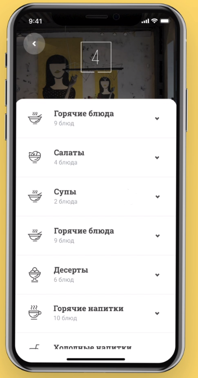

# QR-MENU

Учебный проект курса
[Kotlin Backend Developer](https://otus.ru/lessons/kotlin/?int_source=courses_catalog&int_term=programming).
Поток курса 2023-06.

QR-MENU - это привычное нам меню ресторана, но в более современном формате - электронном. Основные задачи данного проекта:
* предоставление актуального списка блюд и цен посетителю ресторана
* гибкое управление ценами, списком блюд для руководства ресторана

## Визуальная схема фронтенда

## Документация

1. Маркетинг
    1. [Целевая аудитория](./docs/01-marketing/01-target-audience.md)
2. DevOps
   1. [Схема инфраструктуры](./docs/02-devops/01-infrastructure.md)
   2. [Схема мониторинга](./docs/02-devops/02-monitoring.md)
3. Тесты
4. Архитектура
   1. [Компонентная схема](./docs/04-architecture/01-architecture.md)
   2. [Описание API](./docs/04-architecture/02-api.md)
